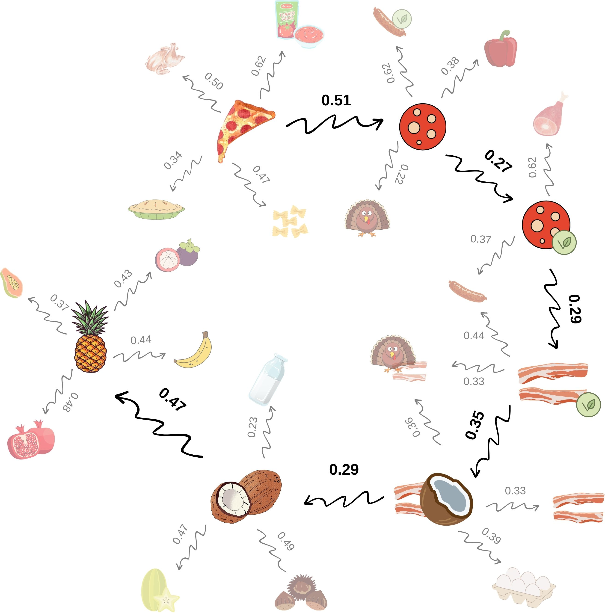

# Embeddings Explorer

For the motivation behind this project, check [this article](https://geppetto.substack.com/p/do-llms-put-pineapple-on-pizza).

In short, this is a framework that allows to generate a graph from a corpus of embeddings and to traverse it.



## Setup

If you want to generate embeddings with OpenAI or Voyage, add a `.env` file in the roof of the project with `OPENAI_API_KEY` and `VOYAGE_API_KEY`

## Usage

You can install the library with the following command:

```bash
python3 -m pip install embeddings-explorer
```

The goal of this library is to offer a few building blocks that allow to generate and navigate an embedding space.

This is a full example usage of the library to get the path and distance from `Pizza` to `Pineapple`:

```python
from embeddings_explorer.corpus.food_corpus_provider import FoodCorpusProvider, Language
from embeddings_explorer.models.openai import OpenAIGenerator
from embeddings_explorer.graph.knn_graph import KnnGraphConstructor
from embeddings_explorer.graph.weighted_traverser import WeightedTraverser
from embeddings_explorer.orchestrator.explorer import EmbeddingsExplorer

language = Language.EN
k=5
path_to_cache = "/path/to/cache/folder/"

start_node = 'Pizza'
end_node = 'Pineapple'

corpus_provider = FoodCorpusProvide (language=language)
embedding_generator = OpenAIGenerator(model_size=model_size)
graph_constructor = KnnGraphConstructor(
    k=k, metric='euclidean', weighted=True, normalize_euclidean=True)
traverser = WeightedTraverser()

explorer = EmbeddingsExplorer(
    corpus_provider, embedding_generator, graph_constructor, traverser, path_to_cache)
path, total_distance = explorer.explore(
    start_node=start_node, end_node=end_node)

print(path)
print(total_distance)
```

The framework defines some key abstract classes that can be extended in order to create something customized:

- `CorpusProvider`: supplies the corpus to generate embeddings for
- `Generator`: given a set of words, generates the embeddings for it
- `GraphConstructor`: given a list of embedding vectors, generates a traversable graph
- `Traverser`: given a start node, end node and graph, traverses the graph to get from one point to the other
